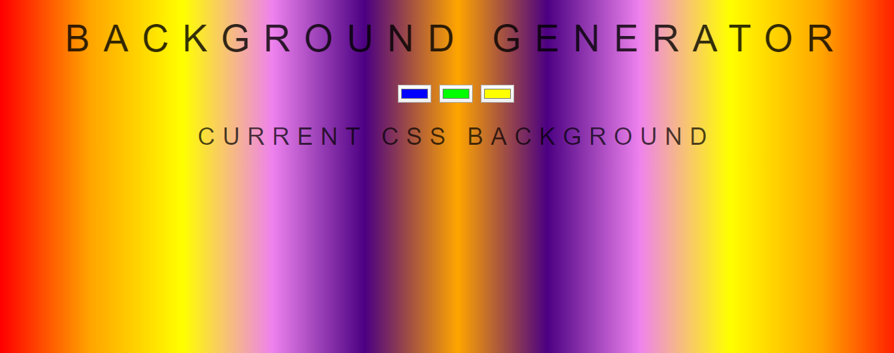
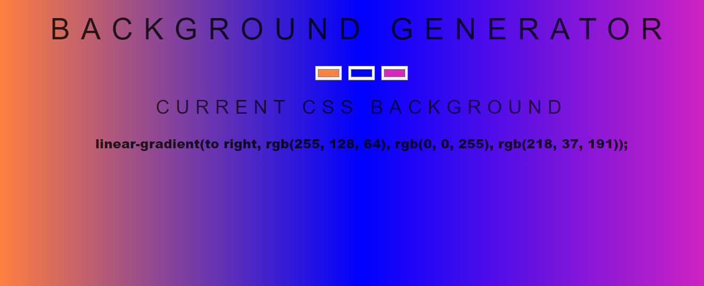

# Background_Generator
Change according to the use needs
# HTML
  * Initiate with heading
  * Three input of class color1,color2,color3.
  * Heading 3 is empty and get edited in javascript.
# CSS
  * Body tag
    1. Using the Raleway and sans-serif combination font.
    2. Linear gradient to right is used in color sequence of VIBGYOR(rainbow) act as an default.
  * Same fromating done in all other headings.
# Java Script
 * With the help of Document Object Model(DOM) var assign to all input using query selector.
 * Function to print the changes done and pass to the heading 3 as well as in background,
 * Finally pass the function to all three color inputs.
 
# Glimpse
 ## Glimpse 1
  
 ## Glimpse 2  
  
    
